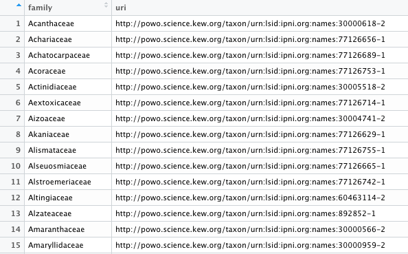

<!-- README.md is generated from README.Rmd. Please edit that file -->

```{r, include = FALSE}
knitr::opts_chunk$set(
  collapse = TRUE,
  comment = "#>",
  fig.path = "man/figures/README-",
  out.width = "100%"
)
```

# expowo

<!-- badges: start -->
<!-- badges: end -->

## Overview

The main goal of the __expowo__ package is to retrieve information the diversity and
distribution of any plant family as publicly available at the taxonomically verified
database [Plants of the World Online (POWO)](https://powo.science.kew.org).
The package is intended to efficiently miner the content on the source html pages
for any specific genus and family. It can return a comma-separated values (CSV) 
file with the number of accepted species and distribution for any genus as well 
as the full checklist of accepted species.

## Installation

You can install the development version of expowo from [GitHub](https://github.com/) using the [devtools](https://github.com/r-lib/devtools) package with:

``` r
install.packages("devtools")
devtools::install_github("deborazuanny/expowo")
```

## Usage

The package's four basic functions (`powoGenera`, `powoSpecies`, `megaGen`, and 
`toptenGen`) requires only the name of the target family (or a vector with multiple 
family names) and the associated specific URI (Uniform Resource Identifier) that 
identifies the html page for each family at POWO. To get the POWO URI for any accepted 
plant family, you can either look at the data frame object under `POWOcodes` that 
come together with the installed expowo package, or you can use the function 
`get_pow` from the package [__taxize__](https://github.com/ropensci/taxize).
So, the vector of URI codes is the main input file to everything you can do with 
expowo package. See below examples on how to use expowo functions to get the basic 
information on the global plant diversity and distribution.


#### _1. `powoGenera`: Extracting a list of plant genera_

This function produces a CSV file listing all genera with associated number
of accepted species and their geographical distribution. You can also narrow down
the search to focus on just a particular genus from a particular country or a list 
of genera from a list of countries.

##### Example of a POWO search with `powoGenera`:
``` r
library(expowo)

powocodes <- taxize::get_pow(c("Fabaceae", "Lecythidaceae"))
powocodes <- data.frame(powocodes)
powocodes <- cbind(family = c("Fabaceae", "Lecythidaceae"), powocodes)

resGenera <- powoGenera(powocodes$family, powocodes$uri,
                         verbose = TRUE)

```

Note that you can choose between the names of individual plant families or search 
for all of them just by adjusting the abovementioned code.

```r
library(expowo)

powocodes <- taxize::get_pow(c("Fabaceae", "Lecythidaceae"))
powocodes <- data.frame(powocodes)
powocodes <- cbind(family = c("Fabaceae", "Lecythidaceae"), powocodes)

resGenera <- powoGenera(powocodes$family, powocodes$uri,
                        verbose = TRUE)
```


#### _2. `powoSpecies`: Extracting a list of plant species_

With this function, you will be able to produce a CSV file of each genus with 
the accepted number of species, considering hybrid species or not, according to 
the data available at POWO's database. You can also narrow down the search to 
focus on just the species from a particular country or a list of countries.

##### Example of a POWO search with `powoSpecies`:





#### _3. `megaGen`: Extracting a list of mega-diverse genera_

This function is intended to produce a CSV file with the most diverse genera of 
any family, based on a threshold number you set. In the following example, we 
choose the plant families "Fabaceae" and "Lecythidaceae" and considered a genus 
as mega-diverse when it more than 500 species, as set in the argument threshold.

##### Example of a POWO search with `megaGen`:
``` r
powocodes <- taxize::get_pow(c("Fabaceae", "Lecythidaceae"))
powocodes <- data.frame(powocodes)
powocodes <- cbind(family = c("Fabaceae", "Lecythidaceae"), powocodes)

resMega <- megaGen(powocodes$family, powocodes$uri,
                   treshold = 500,
                   verbose = TRUE)
```


#### _4. `toptenGen`: Extracting the top ten genera with highest species diversity_

This function is relatively similar to the `megaGen`, but instead of using any 
specific threshold, it produces a CSV file listing the top ten most diverse genera
of any target plant family.


##### Example of a POWO search with `toptenGen`:

```r
powocodes <- taxize::get_pow(c("Araceae", "Lecythidaceae"))
powocodes <- data.frame(powocodes)
powocodes <- cbind(family = c("Araceae", "Lecythidaceae"), powocodes)

resTopten <- toptenGen(powocodes$family, powocodes$uri,
                      verbose = TRUE)
```


## Documentation
A detailed description of the _expowo_'s full functionality will soon be available in [here](https://github.com/deborazuanny/expowo/tree/main/vignettes/).


## Citation
Zuanny, D. & Cardoso, D. (2022). expowo: An R package for mining plant diversity and distribution data. https://github.com/deborazuanny/expowo
